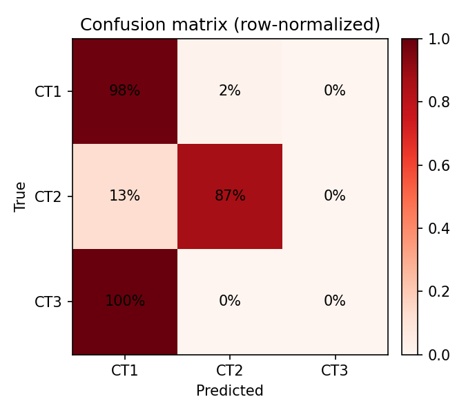
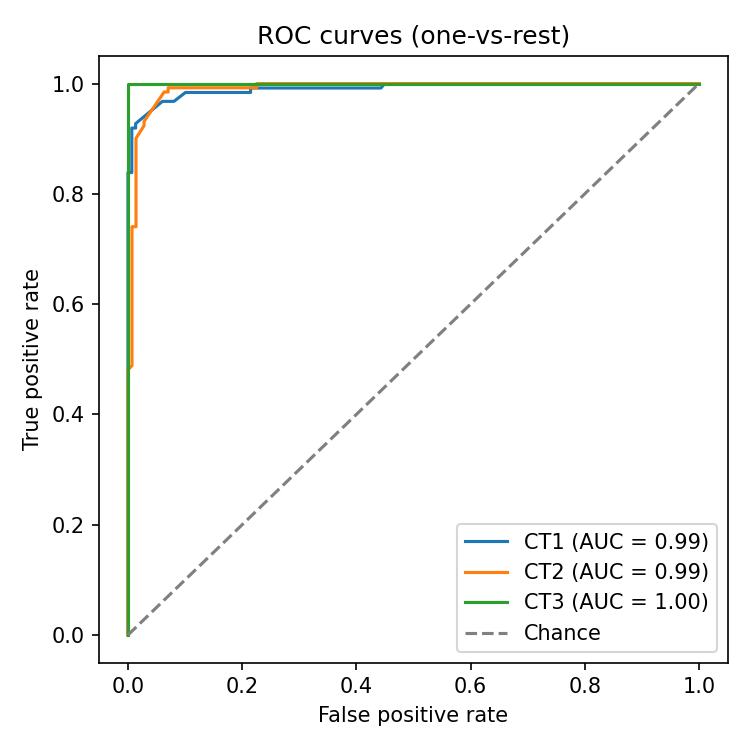
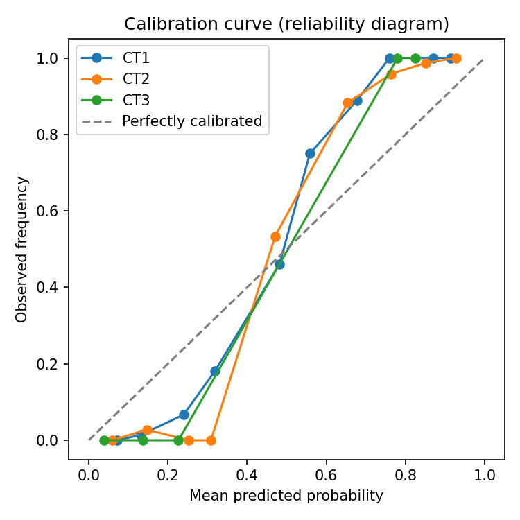

# PR Risk Classifier -- Evaluation Report

273 labeled records evaluated.

## Confusion matrix (rows = true, cols = predicted)

|  | pred CT1 | pred CT2 | pred CT3 |
| --- | --- | --- | --- |
| true CT1 | 122 (98%) | 2 (2%) | 0 (0%) |
| true CT2 | 17 (13%) | 114 (87%) | 0 (0%) |
| true CT3 | 18 (100%) | 0 (0%) | 0 (0%) |

## Per-class precision / recall / F1

| Class | Precision | Recall | F1 | Support |
| --- | --- | --- | --- | --- |
| CT1 | 0.78 | 0.98 | 0.87 | 124 |
| CT2 | 0.98 | 0.87 | 0.92 | 131 |
| CT3 | 0.00 | 0.00 | 0.00 | 18 |

**Macro F1: 0.597**

**Recall(CT1) -- north-star safety metric: 0.984**

## ROC-AUC (one-vs-rest)

| Class | AUC |
| --- | --- |
| CT1 | 0.991 |
| CT2 | 0.991 |
| CT3 | 1.000 |

**Macro AUC: 0.994**

## Calibration

How trustworthy is the model's confidence score? For a well-calibrated model, when it says "70% confident", it should be right about 70% of the time (points near the dashed diagonal = well calibrated).

## Severity-weighted cost

- Total cost: 45
- Mean cost per record: 0.165

## Escalation safety KPIs

- True CT1 predicted as CT2/CT3 (under-escalated): 1.6%
- True CT1/CT2 predicted as CT3 (bulk-approved): 0.0%

## Linear-weighted Cohen's Kappa: 0.648

## Breakdown by decision method

| Method | Count | Correct | Accuracy |
| --- | --- | --- | --- |
| ml-ct3-demoted-to-ct1 | 18 | 0 | 0.00 |
| ml-flag-review | 107 | 104 | 0.97 |
| ml-high-conf | 120 | 120 | 1.00 |
| ml-low-conf-default-ct1 | 28 | 12 | 0.43 |
